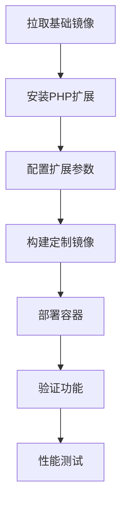

# WordPress Docker 定制镜像产品需求文档

## 1. 产品概述

本项目旨在构建一个基于WordPress官方Docker镜像的定制版本，集成关键PHP扩展以提升性能和缓存能力。

* 解决WordPress在高并发场景下的性能瓶颈问题，为用户提供更快的页面加载速度和更好的用户体验。

* 目标用户为需要部署高性能WordPress站点的开发者和运维人员。

* 通过集成opcache和memcached扩展，显著提升WordPress站点的响应速度和并发处理能力。

## 2. 核心功能

### 2.1 用户角色

| 角色   | 使用方式       | 核心权限                   |
| ---- | ---------- | ---------------------- |
| 开发者  | Docker镜像部署 | 可以拉取和部署定制镜像，配置PHP扩展参数  |
| 运维人员 | 容器管理       | 可以管理容器生命周期，监控性能指标，调整配置 |

### 2.2 功能模块

本WordPress Docker定制镜像包含以下核心组件：

1. **基础镜像层**：基于WordPress官方Docker镜像，保持完全兼容性
2. **PHP扩展层**：集成opcache和memcached扩展及其依赖
3. **配置优化层**：针对性能优化的PHP和扩展配置
4. **部署支持层**：Docker Compose配置和部署脚本

### 2.3 页面详情

| 组件名称   | 模块名称        | 功能描述                                             |
| ------ | ----------- | ------------------------------------------------ |
| 基础镜像层  | WordPress核心 | 继承官方WordPress镜像的所有功能，包括Apache/Nginx、PHP、MySQL连接等 |
| PHP扩展层 | OPcache扩展   | 提供PHP字节码缓存，减少脚本编译时间，提升执行效率                       |
| PHP扩展层 | Memcached扩展 | 提供分布式内存缓存功能，支持对象缓存和会话存储                          |
| 配置优化层  | PHP配置       | 优化内存限制、执行时间、上传大小等PHP参数                           |
| 配置优化层  | 扩展配置        | 配置opcache缓存大小、过期时间、memcached连接参数等                |
| 部署支持层  | Docker配置    | 提供Dockerfile、docker-compose.yml和环境变量配置           |
| 部署支持层  | 启动脚本        | 自动化容器启动、健康检查和配置验证脚本                              |

## 3. 核心流程

**开发者使用流程：**

1. 拉取定制Docker镜像
2. 配置环境变量和挂载卷
3. 启动容器并验证扩展加载
4. 部署WordPress应用

**运维人员管理流程：**

1. 监控容器运行状态
2. 调整PHP和扩展配置参数
3. 执行性能测试和优化
4. 管理容器更新和备份

## 4. 用户界面设计

### 4.1 设计风格

* **主色调**：Docker蓝色(#2496ED)和WordPress蓝色(#21759B)

* **辅助色**：成功绿色(#28A745)、警告橙色(#FFC107)、错误红色(#DC3545)

* **字体**：等宽字体用于代码显示，无衬线字体用于文档

* **布局风格**：命令行界面风格，清晰的层次结构

* **图标风格**：简洁的线性图标，Docker和WordPress官方图标

### 4.2 页面设计概览

| 组件名称       | 模块名称  | UI元素                  |
| ---------- | ----- | --------------------- |
| Dockerfile | 构建配置  | 清晰的分层结构，注释说明，语法高亮     |
| 配置文件       | PHP配置 | 结构化的INI格式，参数分组，性能建议注释 |

