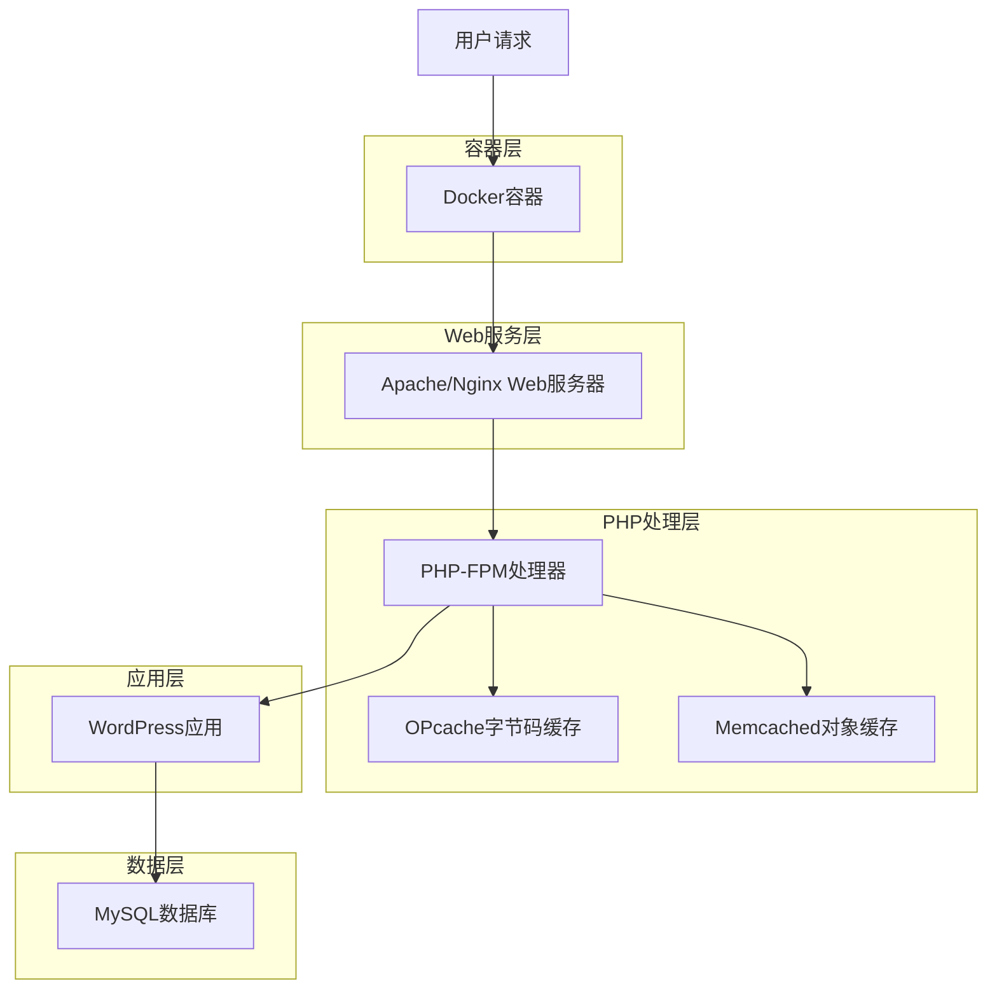
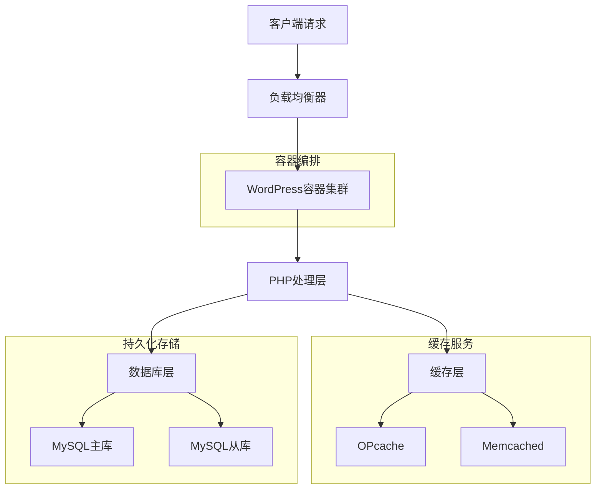

# WordPress Docker 定制镜像技术架构文档

## 1. 架构设计



## 2. 技术描述

* **基础镜像**: wordpress:latest (官方WordPress Docker镜像)

* **Web服务器**: Apache 2.4 (内置于WordPress镜像)

* **PHP版本**: PHP 8.1+ (跟随WordPress官方镜像)

* **核心扩展**: opcache, memcached, libmemcached

* **构建工具**: Docker, docker-compose

* **配置管理**: 环境变量 + 配置文件挂载

## 3. 路由定义

| 路径           | 用途                            |
| ------------ | ----------------------------- |
| /            | WordPress主页，通过Apache处理静态和动态请求 |
| /wp-admin    | WordPress管理后台，启用OPcache加速     |
| /wp-content  | 静态资源目录，Apache直接处理             |
| /wp-includes | WordPress核心文件，OPcache缓存优化     |

## 4. 容器构建定义

### 4.1 Dockerfile结构

```dockerfile
# 基于WordPress官方镜像
FROM wordpress:latest

# 安装系统依赖
RUN apt-get update && apt-get install -y \
    libmemcached-dev \
    zlib1g-dev \
    libssl-dev \
    && rm -rf /var/lib/apt/lists/*

# 安装PHP扩展
RUN docker-php-ext-enable opcache
RUN pecl install memcached && docker-php-ext-enable memcached

# 复制配置文件
COPY php.ini /usr/local/etc/php/
COPY opcache.ini /usr/local/etc/php/conf.d/
COPY memcached.ini /usr/local/etc/php/conf.d/

# 复制WordPress object-cache.php文件
COPY wp-content/object-cache.php /var/www/html/wp-content/object-cache.php

# 设置权限
RUN chown -R www-data:www-data /var/www/html

# 健康检查
HEALTHCHECK --interval=30s --timeout=3s --start-period=5s --retries=3 \
    CMD curl -f http://localhost/ || exit 1
```

### 4.2 Docker Compose配置

```yaml
version: '3.8'

services:
  wordpress:
    build: .
    ports:
      - "8080:80"
    environment:
      WORDPRESS_DB_HOST: db
      WORDPRESS_DB_USER: wordpress
      WORDPRESS_DB_PASSWORD: wordpress
      WORDPRESS_DB_NAME: wordpress
    volumes:
      - ./html:/var/www/html
    depends_on:
      - db
      - memcached
    networks:
      - wordpress_network

  db:
    image: mysql:8.0
    environment:
      MYSQL_DATABASE: wordpress
      MYSQL_USER: wordpress
      MYSQL_PASSWORD: wordpress
      MYSQL_ROOT_PASSWORD: rootpassword
    volumes:
      - ./db:/var/lib/mysql
    networks:
      - wordpress_network

  memcached:
    image: memcached:alpine
    command: memcached -m 64
    networks:
      - wordpress_network

volumes:
  wordpress_data:
  db_data:

networks:
  wordpress_network:
    driver: bridge
```

## 5. 服务架构图



## 6. 配置模型

### 6.1 PHP配置优化

**php.ini 关键配置**

```ini
; 内存和执行时间
memory_limit = 256M
max_execution_time = 300
max_input_time = 300

; 文件上传
upload_max_filesize = 64M
post_max_size = 64M
max_file_uploads = 20

; 会话配置
session.save_handler = memcached
session.save_path = "memcached:11211"

; 错误报告
log_errors = On
error_log = /var/log/php_errors.log
```

**opcache.ini 配置**

```ini
; OPcache基础配置
opcache.enable = 1
opcache.enable_cli = 1
opcache.memory_consumption = 128
opcache.interned_strings_buffer = 8
opcache.max_accelerated_files = 4000

; 性能优化
opcache.revalidate_freq = 2
opcache.fast_shutdown = 1
opcache.save_comments = 1

; 开发环境配置
opcache.validate_timestamps = 1
opcache.revalidate_path = 0
```

**memcached.ini 配置**

```ini
; Memcached扩展配置
memcached.use_sasl = 0
memcached.sess_locking = 1
memcached.sess_consistent_hash = 1
memcached.sess_binary = 0
memcached.sess_lock_wait_min = 1000
memcached.sess_lock_wait_max = 2000
```

### 6.2 环境变量配置

| 变量名                       | 默认值       | 描述              |
| ------------------------- | --------- | --------------- |
| OPCACHE\_MEMORY           | 128       | OPcache内存大小(MB) |
| OPCACHE\_MAX\_FILES       | 4000      | 最大缓存文件数         |
| MEMCACHED\_HOST           | memcached | Memcached服务器地址  |
| MEMCACHED\_PORT           | 11211     | Memcached端口     |
| PHP\_MEMORY\_LIMIT        | 256M      | PHP内存限制         |
| PHP\_MAX\_EXECUTION\_TIME | 300       | 最大执行时间          |

### 6.3 构建和部署脚本

**build.sh**

```bash
#!/bin/bash
set -e

echo "构建WordPress定制Docker镜像..."
docker build -t wordpress-custom:latest .

echo "验证扩展安装..."
docker run --rm wordpress-custom:latest php -m | grep -E "(opcache|memcached)"

echo "构建完成！"
```

**deploy.sh**

```bash
#!/bin/bash
set -e

echo "部署WordPress定制镜像..."
docker-compose up -d

echo "等待服务启动..."
sleep 30

echo "验证服务状态..."
docker-compose ps

echo "检查扩展状态..."
curl -s http://localhost/wp-admin/admin.php?page=health-check | grep -i "opcache\|memcached" || echo "请手动验证扩展状态"

echo "部署完成！"
```

